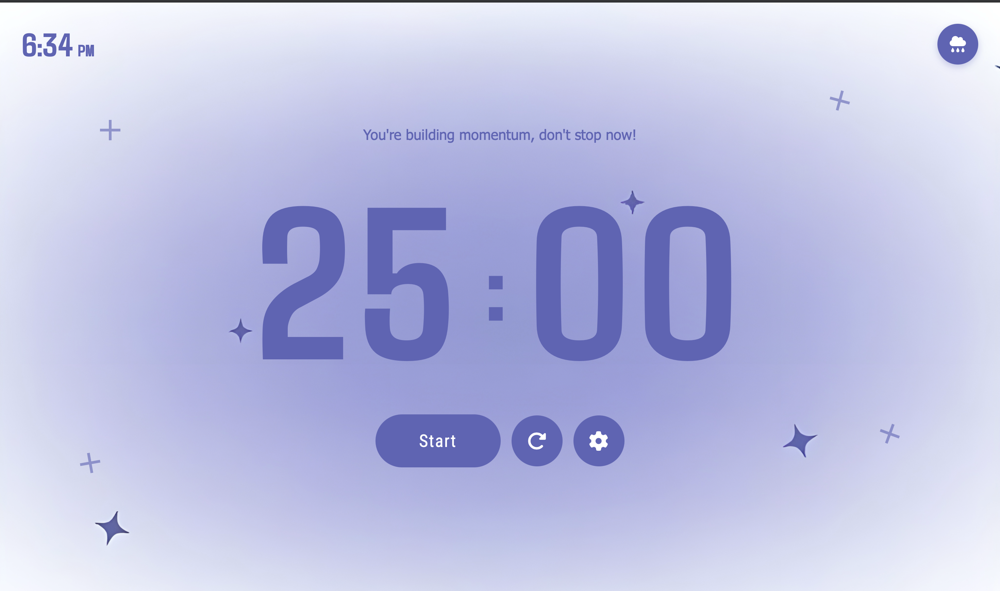

# Pomodoro Timer

A modern, minimalist Pomodoro Timer web application with ambient audio features and a clean, distraction-free interface.



## Features

### Core Functionality
- **Customizable work sessions** with 5-minute breaks (customizable)
- **Visual timer display** with large, readable digits
- **Automatic session switching** between work and break periods
- **Session notifications** with audio alerts
- **Motivational messages** that update based on session type

### Audio Experience
- **Ambient rain sounds** for enhanced focus
- **Toggle control** for background audio on/off

### User Interface
- **Clean, minimal design** focused on productivity
- **Responsive layout** adapts to all screen sizes
- **Live clock display** in top-right corner
- **Animated watcher mascot** for encouragement
- **Subtle sparkle effects** for visual interest
- **Settings modal** for time customization

### Controls
- **Start/Pause button** for session control
- **Reset button** to restart current session
- **Settings button** to customize work/break durations
- **Rain toggle** for ambient sound control

## Technology Stack

- **HTML5** - Semantic structure
- **CSS3** - Modern styling with animations
- **Vanilla JavaScript** - No framework dependencies
- **Font Awesome** - Icon library
- **Lottie animations** - Smooth, scalable animations

## Audio Files

The application uses two audio components:

1. **Notification Sound** - Session completion alert
2. **Rain Sound** (`light_rain.wav`) - Ambient background audio

## Customization

Users can adjust:
- Work session duration (1-60 minutes)
- Break duration (1-30 minutes)
- Background audio on/off

## Usage

1. Open `main.html` in a web browser
2. Click **Start** to begin a work session
3. Toggle rain sounds using the cloud icon
4. Access settings via the gear icon
5. Timer automatically switches to break after work session completes

## Design Philosophy

The interface prioritizes clarity and focus:
- Large, easy-to-read timer display
- Minimal color palette reduces visual noise
- Strategic use of animation draws attention without distraction
- Audio features are optional and user-controlled
- Settings are accessible but hidden during focus time

## Browser Compatibility

Works on all modern browsers supporting:
- HTML5 Audio API
- CSS Grid and Flexbox
- ES6 JavaScript
- Web Components (for Lottie animations)

## File Structure

```
day5/
├── main.html          # Main HTML structure
├── style.css          # Styling and animations
├── script.js          # Timer logic and functionality
├── light_rain.wav     # Ambient audio file
├── images/            # Additional assets
└── README.md          # Documentation
```

## License

This project is part of a 30-day coding challenge.
